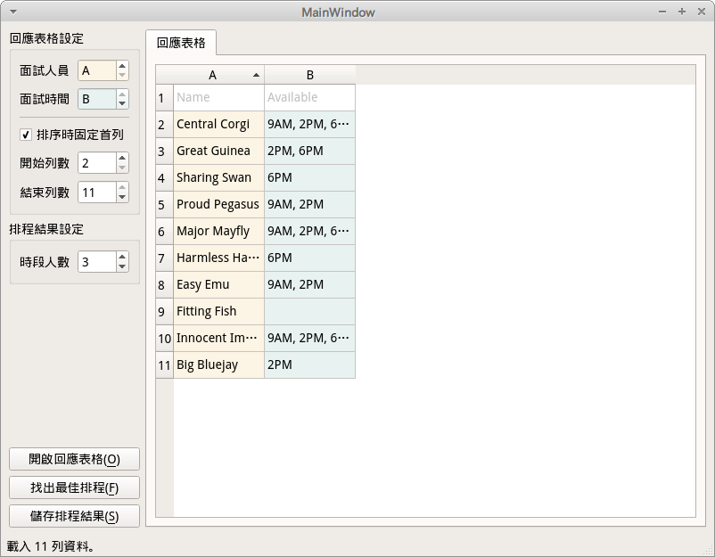
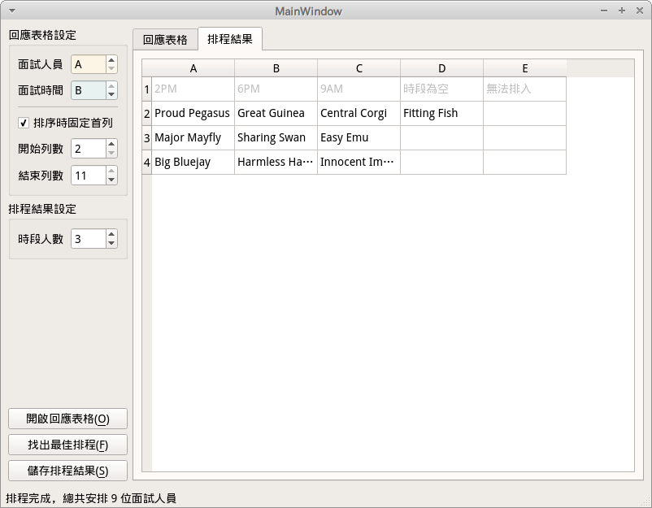

[](https://travis-ci.com/RedBug312/ntuoc13-interview-scheduler)

Interviews scheduler desktop app for National Taiwan University Orientation Camp.




## Quickstart

```bash
$ sudo apt install python3.6-venv
$ make start
```

It builds on Python 3.6 for fbs free version.

The app uses maximum flow algorithm from [NetworkX] to solve the scheduling
problem, and the implementation refers to `src/main/python/window.py`. The input
sheet takes `xlsx` format only.

## Credits

- [PyQt5] - Python bindings for the Qt cross platform application toolkit.
- [Fman] - Create Python GUIs with Qt in minutes.
- [NetworkX] - Network Analysis in Python.

[PyQt5]: https://www.riverbankcomputing.com/software/pyqt/
[Fman]: https://build-system.fman.io/
[NetworkX]: https://networkx.org/
