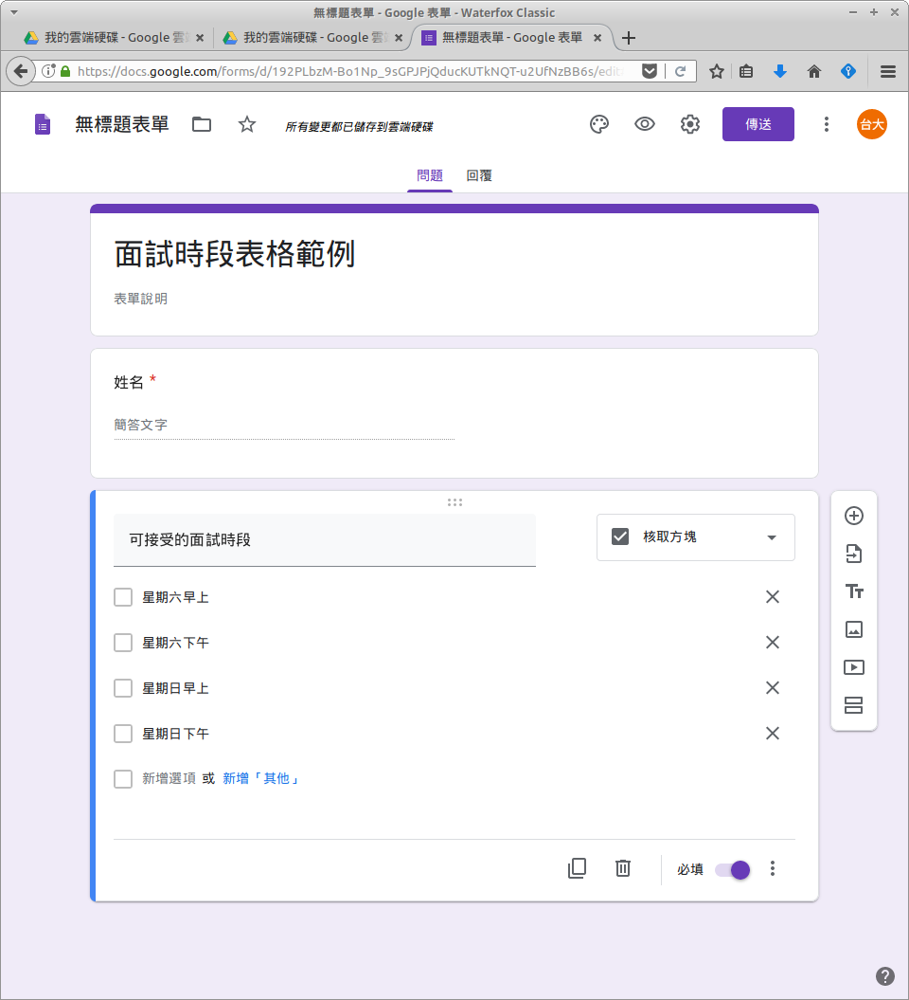
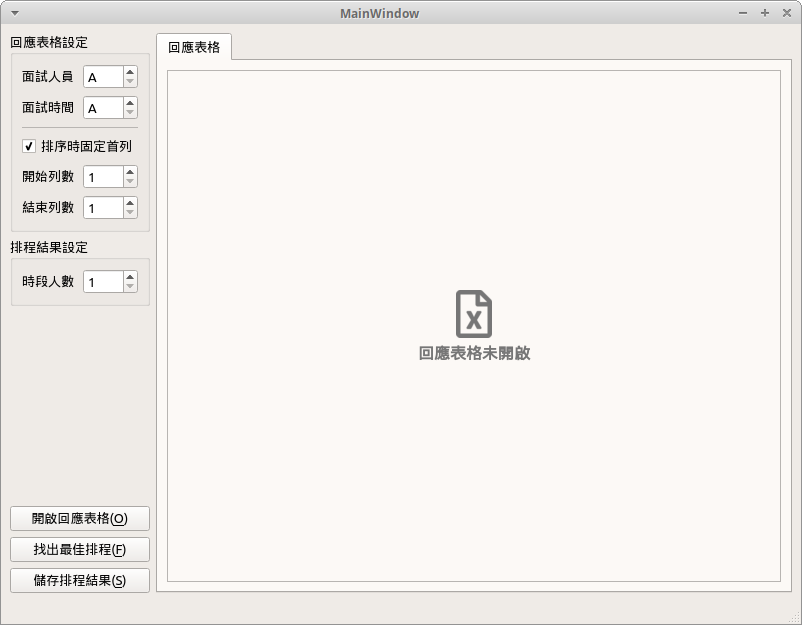
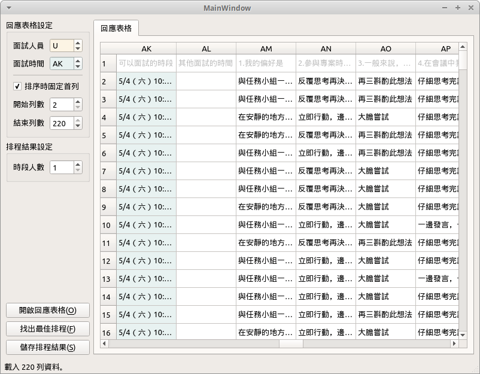
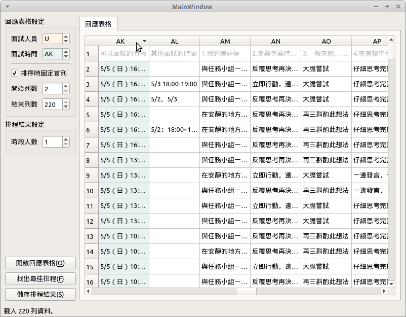
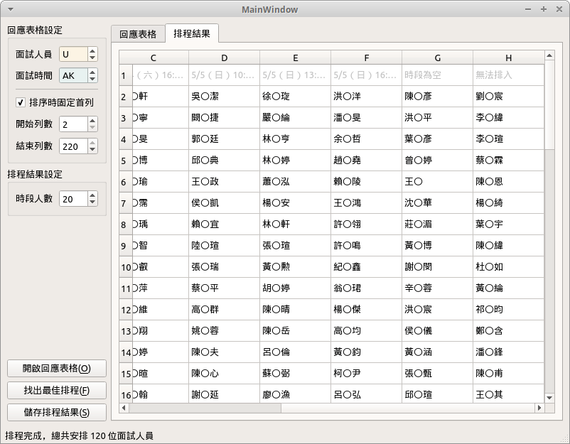
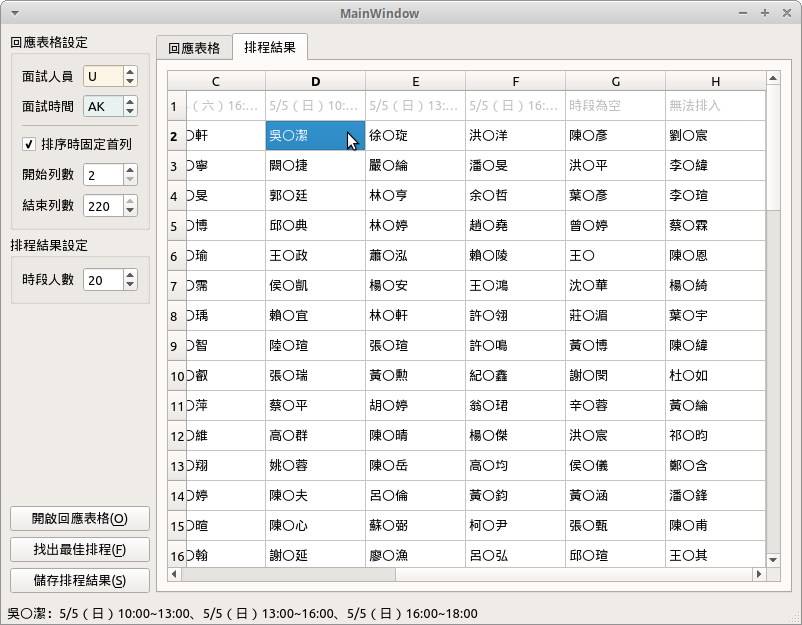
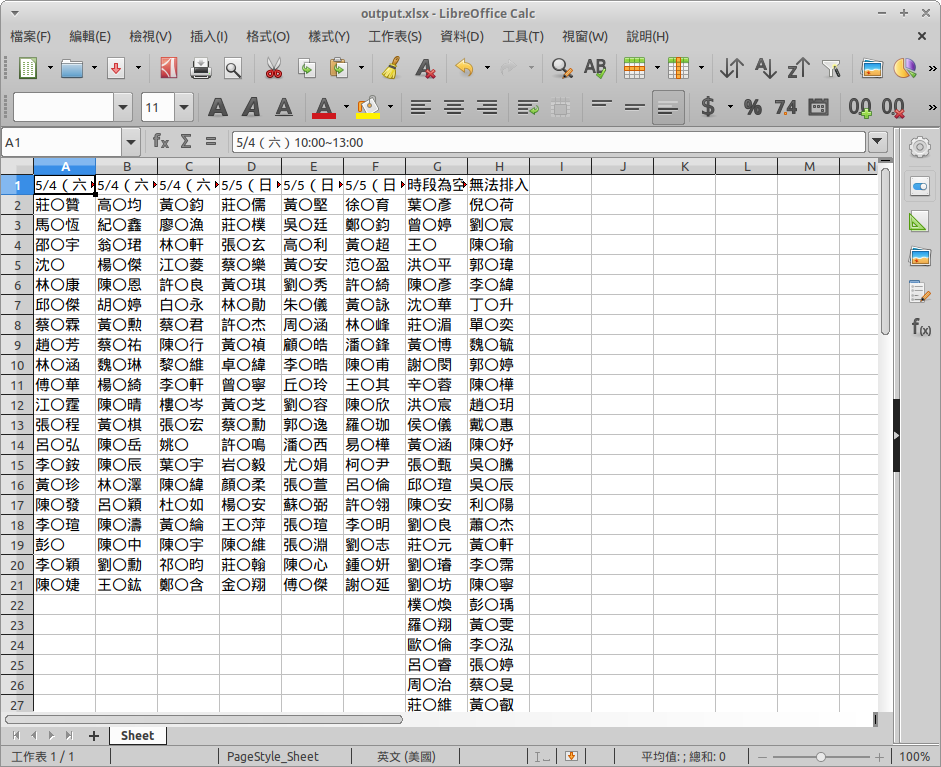

# 使用說明

請至 [Releases](https://github.com/RedBug312/ntuoc13-interview-scheduler/releases) 下載最新版安裝檔案。Windows 作業系統需下載 Assets 下的 `ntuoc13-interview-scheduler-installer.exe`，並執行安裝。

此程式會讀入由 Google 表單回應匯出的 xlsx 檔案，為使面試時段選項容易區分，在設計 Google 表單問題時有些限制。請將面試時間設定為多選，並且避免如「以上皆否」、「其他...」的選項，避免這些選項被誤認為其中一種排程時間，正確範例如下：

如此，收到的表單回應會以**半形逗號**區隔每個選項，例如 `星期六上午, 星期日上午`，未選則會顯示為空。

「重複面試人員」可能會因該人員重複填寫回應，或是多個人員剛好同名導致。目前無法很好地處理這項問題，但僅會挑選排序過的後者進行排程，因此不影響其他人的排程正確性；且會跳出訊息顯示該重複人員姓名，建議手動檢查該人員之回應。

## 開啟回應表格

開啟程式後會顯示「回應表格未開啟」訊息，點擊左下角「開啟回應表格」按鈕選取回應表格，或是將回應表格拖曳至訊息上方。

之後需要設定正確的儲存格範圍。黃底表示面試人員、藍底表示面試時間，調整欄數與列數使兩者範圍正好落在欲排程的回應欄位。

點擊欄數可以讓表格對該欄進行排序，做更精細的範圍調整。「排序時固定首列」會使排序忽略第一列，因為第一列通常是 Google 表單回應的題目，打勾時會呈現灰字。

## 找出最佳排程

設定「時段人數」，目前僅讓每個時段有相同人數限制。之後點擊「找出最佳排程」會顯示排程結果分頁：第一列是各個時段、之後為排入該時段的人員姓名。

除了所有時段，後方會在新增兩欄為「時段為空」、「無法排入」。前者代表該人員並未選擇任何面試時段，後者代表該人員雖有選擇時段但程式無法將其排入。

點擊排程結果的人員姓名，會在下方顯示當初回應填寫的時段，方便使用者直接抽查以驗證正確性。

## 儲存排程結果

點擊「儲存排程結果」會將排程分頁儲存為 xlsx 檔案。

